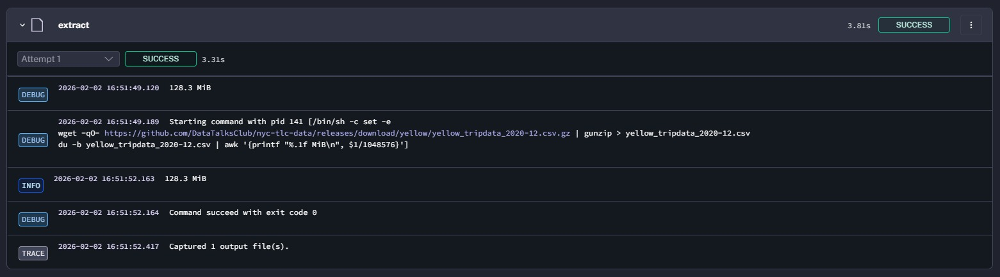

# Module 2 Homework: Workflow Orchestration

This repository contain the code for solving the homework of Data Engineering Zoomcamp 2026 Module 2.

## Quiz Questions

Complete the quiz shown below. It's a set of 6 multiple-choice questions to test your understanding of workflow orchestration, Kestra, and ETL pipelines.

1) Within the execution for `Yellow` Taxi data for the year `2020` and month `12`: what is the uncompressed file size (i.e. the output file `yellow_tripdata_2020-12.csv` of the `extract` task)?
- 128.3 MiB
- 134.5 MiB
- 364.7 MiB
- 692.6 MiB

### Solution 1

To see the uncompressed file size, I add additional command and the task script is written below:

```
  - id: extract
    type: io.kestra.plugin.scripts.shell.Commands
    outputFiles:
      - "*.csv"
    taskRunner:
      type: io.kestra.plugin.core.runner.Process
    commands:
      - wget -qO- https://github.com/DataTalksClub/nyc-tlc-data/releases/download/{{inputs.taxi}}/{{render(vars.file)}}.gz | gunzip > {{render(vars.file)}}
      - du -b {{render(vars.file)}} | awk '{printf "%.1f MiB\n", $1/1048576}'  # This is bash command to list and look for file size
```

Resulting:


> Answer: 128.3 MiB

2) What is the rendered value of the variable `file` when the inputs `taxi` is set to `green`, `year` is set to `2020`, and `month` is set to `04` during execution?
- `{{inputs.taxi}}_tripdata_{{inputs.year}}-{{inputs.month}}.csv` 
- `green_tripdata_2020-04.csv`
- `green_tripdata_04_2020.csv`
- `green_tripdata_2020.csv`

### Solution 2

With the script written:
```
file = "{{inputs.taxi}}_tripdata_{{inputs.year}}-{{inputs.month}}.csv"
```

Rendered value of the variables will be subtitute with the inputs. Therefore rendered value during execution will be `green_tripdata_2020-04.csv`

> Answer: `green_tripdata_2020-04.csv`

3) How many rows are there for the `Yellow` Taxi data for all CSV files in the year 2020?
- 13,537.299
- 24,648,499
- 18,324,219
- 29,430,127

### Solution 3

To solve this question, I use the script of flow to extract, merge all the dataset, and store it on Postgre database. Full script of the flow for this solution is available on [02-homework-no-3-4.yaml](dsad). With that script, I use backfill to get the data from 2020 of yellow taxi. Then, I take the data using this query in PGAdmin:

```
SELECT COUNT(*) AS total_rows
FROM public.yellow_tripdata;
```

> Answer: 24,648,499

4) How many rows are there for the `Green` Taxi data for all CSV files in the year 2020?
- 5,327,301
- 936,199
- 1,734,051
- 1,342,034

### Solution 4

To solve this question, I use the same script of flow as Solution 3 to extract, merge all the dataset, and store it on Postgre database. Full script of the flow for this solution is available on [02-homework-no-3-4.yaml](dsad). With that script, I use backfill to get the data from 2020 of green taxi. Then, I take the data using this query in PGAdmin:

```
SELECT COUNT(*) AS total_rows
FROM public.green_tripdata;
```

> Answer: 1,734,051

5) How many rows are there for the `Yellow` Taxi data for the March 2021 CSV file?
- 1,428,092
- 706,911
- 1,925,152
- 2,561,031

### Solution 5

To solve this question, I made different Kestra flow that specified to extract data per month per year and query to calculate number of the data. Full script of the flow for this solution is available on [02-homework-no-5.yaml](dsad)

> Answer: 1,925,152

6) How would you configure the timezone to New York in a Schedule trigger?
- Add a `timezone` property set to `EST` in the `Schedule` trigger configuration  
- Add a `timezone` property set to `America/New_York` in the `Schedule` trigger configuration
- Add a `timezone` property set to `UTC-5` in the `Schedule` trigger configuration
- Add a `location` property set to `New_York` in the `Schedule` trigger configuration 

### Solution 6

Based on example in Kestra documentation [link](https://kestra.io/docs/workflow-components/triggers/schedule-trigger) below:

```
triggers:
  - id: daily
    type: io.kestra.plugin.core.trigger.Schedule
    cron: "@daily"
    timezone: America/New_York
```

We need to set `Schedule` to trigger configuration and add a `timezone` property set to `America/New_York`.

> Answer: Add a `timezone` property set to `America/New_York` in the `Schedule` trigger configuration